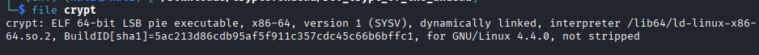
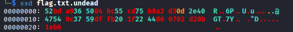
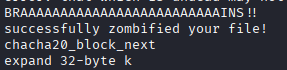

# UndeadofTheCrypt

**Category ** Reverse Engineering 

**Difficulty:** Very Easy

**Tags:** `Static Analysis`, `Ghidra`, `Python Scripting`, `ChaCha20`

---

# Description
*All my important files have been zombified by the notorious Zombie Cybercrime Gang. Can you lay them to rest and bring my files back?*

## 1. Introduction
Given an ELF binary, `crypt`, to encrypt a file and add extension "undead", also the encrypted text, `flag.txt.undead`. Our task is to decrypt the encrypted flag.





## 2. Analysis
I start analysis by using `strings`.



Here i found an interesting strings. It maybe encrypted using ChaCha20 algorithm. For deeper analysis, let's decompile the binary using Ghidra. 

```
undefined4 main(int param_1,undefined8 *param_2)
{
  int iVar1;
  size_t sVar2;
  char *__dest;
  char *pcVar3;
  undefined4 uVar4;
  long in_FS_OFFSET;
  void *local_40;
  size_t local_38;
  long local_30;
  
  local_30 = *(long *)(in_FS_OFFSET + 0x28);
  if (param_1 < 2) {
    pcVar3 = "crypt";
    if (param_1 == 1) {
      pcVar3 = (char *)*param_2;
    }
    uVar4 = 1;
    printf("Usage: %s file_to_encrypt\n",pcVar3);
  }
  else {
    pcVar3 = (char *)param_2[1];
    iVar1 = ends_with(pcVar3,".undead");
    if (iVar1 == 0) {
      sVar2 = strlen(pcVar3);
      __dest = malloc(sVar2 + 9);
      strncpy(__dest,pcVar3,sVar2 + 9);
      sVar2 = strlen(__dest);
      builtin_strncpy(__dest + sVar2,".undead",8);
      iVar1 = read_file(pcVar3,&local_38,&local_40);
      if (iVar1 == 0) {
        encrypt_buf(local_40,local_38,"BRAAAAAAAAAAAAAAAAAAAAAAAAAINS!!");
        iVar1 = rename(pcVar3,__dest);
        if (iVar1 == 0) {
          iVar1 = open(__dest,0x201);
          if (iVar1 < 0) {
            uVar4 = 5;
            perror("error opening new file");
          }
          else {
            write(iVar1,local_40,local_38);
            close(iVar1);
            puts("successfully zombified your file!");
            uVar4 = 0;
          }
        }
        else {
          uVar4 = 4;
          perror("error renaming file");
        }
      }
      else {
        uVar4 = 3;
        perror("error reading file");
      }
    }
    else {
      uVar4 = 2;
      puts("error: that which is undead may not be encrypted");
    }
  }
  if (local_30 == *(long *)(in_FS_OFFSET + 0x28)) {
    return uVar4;
  }
                    /* WARNING: Subroutine does not return */
  __stack_chk_fail();
}
```

At the `main` function, we can see that this binary required a parameter, which is the file to encrypt. We can see there is an interesting function `encrypt_buf`. This function maybe used to encrypt the file. Let's see deeper in this function.

```
void encrypt_buf(undefined8 param_1,undefined8 param_2,undefined8 param_3)
{
  long in_FS_OFFSET;
  undefined1 auStack_f8 [204];
  undefined8 local_2c;
  undefined4 local_24;
  long local_20;
  
  local_20 = *(long *)(in_FS_OFFSET + 0x28);
  local_2c = 0;
  local_24 = 0;
  chacha20_init_context(auStack_f8,param_3,&local_2c,0);
  chacha20_xor(auStack_f8,param_1,param_2);
  if (local_20 == *(long *)(in_FS_OFFSET + 0x28)) {
    return;
  }
                    /* WARNING: Subroutine does not return */
  __stack_chk_fail();
}
```

At `encrypt_buf`, we can see this is the ChaCha20 wrapper. ChaCha20 is a high-speed stream cipher that constructs its internal state as a 4x4 matrix containing a secret 256-bit key, a unique nonce, a block counter, and fixed constants. To encrypt data, this matrix undergoes 20 rounds of "Add-Rotate-XOR" operations to generate a pseudo-random keystream, which is then combined with your message to produce the ciphertext. This is a part of symetric encryption.

```
void chacha20_init_context
               (undefined8 *param_1,undefined8 *param_2,undefined8 *param_3,undefined8 param_4)
{
  undefined4 uVar1;
  undefined8 uVar2;
  ulong uVar3;
  undefined8 *puVar4;
  
  *param_1 = 0;
  param_1[0x17] = 0;
  puVar4 = (undefined8 *)((ulong)(param_1 + 1) & 0xfffffffffffffff8);
  for (uVar3 = (ulong)(((int)param_1 -
                       (int)(undefined8 *)((ulong)(param_1 + 1) & 0xfffffffffffffff8)) + 0xc0U >> 3)
      ; uVar3 != 0; uVar3 = uVar3 - 1) {
    *puVar4 = 0;
    puVar4 = puVar4 + 1;
  }
  uVar2 = param_2[1];
  param_1[9] = *param_2;
  param_1[10] = uVar2;
  uVar2 = param_2[3];
  param_1[0xb] = param_2[2];
  param_1[0xc] = uVar2;
  param_1[0xd] = *param_3;
  uVar1 = *(undefined4 *)(param_3 + 1);
  param_1[0x10] = 0x3320646e61707865;
  param_1[0x11] = 0x6b20657479622d32;
  *(undefined4 *)(param_1 + 0xe) = uVar1;
  *(undefined4 *)(param_1 + 0x12) = *(undefined4 *)param_2;
  *(undefined4 *)((long)param_1 + 0x94) = *(undefined4 *)((long)param_2 + 4);
  *(undefined4 *)(param_1 + 0x13) = *(undefined4 *)(param_2 + 1);
  *(undefined4 *)((long)param_1 + 0x9c) = *(undefined4 *)((long)param_2 + 0xc);
  *(undefined4 *)(param_1 + 0x14) = *(undefined4 *)(param_2 + 2);
  *(undefined4 *)((long)param_1 + 0xa4) = *(undefined4 *)((long)param_2 + 0x14);
  *(undefined4 *)(param_1 + 0x15) = *(undefined4 *)(param_2 + 3);
  *(undefined4 *)((long)param_1 + 0xac) = *(undefined4 *)((long)param_2 + 0x1c);
  *(undefined4 *)((long)param_1 + 0xb4) = *(undefined4 *)param_3;
  *(undefined4 *)(param_1 + 0x17) = *(undefined4 *)((long)param_3 + 4);
  *(undefined4 *)((long)param_1 + 0xbc) = *(undefined4 *)(param_3 + 1);
  param_1[0xd] = *param_3;
  uVar1 = *(undefined4 *)(param_3 + 1);
  *(int *)(param_1 + 0x16) = (int)param_4;
  *(undefined4 *)(param_1 + 0xe) = uVar1;
  *(int *)((long)param_1 + 0xb4) = (int)((ulong)param_4 >> 0x20) + *(int *)(param_1 + 0xd);
  param_1[0xf] = param_4;
  param_1[8] = 0x40;
  return;
}
```

In this function the `param_1`, the matrix used to store the initialized the state. To decrypt we just need to have the key, nonce, and the encrypted. Because we already have the requirement, we just need to make the decryption script. This is the solver i make.

```
from Crypto.Cipher import ChaCha20
import sys
import os

def decrypt_file(filename):
    key_string = "BRAAAAAAAAAAAAAAAAAAAAAAAAAINS!!"
    key = key_string.encode('utf-8')[:32]
    nonce = b'\x00' * 12
    with open(filename, 'rb') as f:
        ciphertext = f.read()
    cipher = ChaCha20.new(key=key, nonce=nonce)
    plaintext = cipher.decrypt(ciphertext)
    print(plaintext)

if __name__ == "__main__":
    decrypt_file(sys.argv[1])
```

After run the script, i get the flag

# `HTB{und01ng_th3_curs3_0f_und34th}`