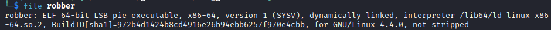
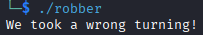
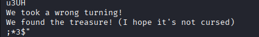

# ** Graverobber

**Category:** Reverse Engineering 
**Difficulty:** Very Easy
**Tags:** `Static Analysis`, `Ghidra`, `Python Scripting`

---

# Description
*We're breaking into the catacombs to find a rumoured great treasure - I hope there's no vengeful spirits down there...*

## 1. Introduction
The challenge begins with a ELF Binary named `robber`. 


## 2. Analysis
I begin analysis by run the binary.


It just return a message. I also use `strings` to see any interesting string inside this binary. 



We can see there is 2 message, the winning message and the wrong message. But the problem is we cannot give input to this binary, so i use ghidra to decompile the binary to get more information.

```

undefined8 main(void)

{
  int iVar1;
  undefined8 uVar2;
  long in_FS_OFFSET;
  uint length;
  stat local_e8;
  char local_58 [72];
  long local_10;
  
  local_10 = *(long *)(in_FS_OFFSET + 0x28);
  local_58[0] = '\0';
  local_58[1] = '\0';
  local_58[2] = '\0';
  local_58[3] = '\0';
  local_58[4] = '\0';
  local_58[5] = '\0';
  local_58[6] = '\0';
  local_58[7] = '\0';
  local_58[8] = '\0';
  local_58[9] = '\0';
  local_58[10] = '\0';
  local_58[0xb] = '\0';
  local_58[0xc] = '\0';
  local_58[0xd] = '\0';
  local_58[0xe] = '\0';
  local_58[0xf] = '\0';
  local_58[0x10] = '\0';
  local_58[0x11] = '\0';
  local_58[0x12] = '\0';
  local_58[0x13] = '\0';
  local_58[0x14] = '\0';
  local_58[0x15] = '\0';
  local_58[0x16] = '\0';
  local_58[0x17] = '\0';
  local_58[0x18] = '\0';
  local_58[0x19] = '\0';
  local_58[0x1a] = '\0';
  local_58[0x1b] = '\0';
  local_58[0x1c] = '\0';
  local_58[0x1d] = '\0';
  local_58[0x1e] = '\0';
  local_58[0x1f] = '\0';
  local_58[0x20] = '\0';
  local_58[0x21] = '\0';
  local_58[0x22] = '\0';
  local_58[0x23] = '\0';
  local_58[0x24] = '\0';
  local_58[0x25] = '\0';
  local_58[0x26] = '\0';
  local_58[0x27] = '\0';
  local_58[0x28] = '\0';
  local_58[0x29] = '\0';
  local_58[0x2a] = '\0';
  local_58[0x2b] = '\0';
  local_58[0x2c] = '\0';
  local_58[0x2d] = '\0';
  local_58[0x2e] = '\0';
  local_58[0x2f] = '\0';
  local_58[0x30] = '\0';
  local_58[0x31] = '\0';
  local_58[0x32] = '\0';
  local_58[0x33] = '\0';
  local_58[0x34] = '\0';
  local_58[0x35] = '\0';
  local_58[0x36] = '\0';
  local_58[0x37] = '\0';
  local_58[0x38] = '\0';
  local_58[0x39] = '\0';
  local_58[0x3a] = '\0';
  local_58[0x3b] = '\0';
  local_58[0x3c] = '\0';
  local_58[0x3d] = '\0';
  local_58[0x3e] = '\0';
  local_58[0x3f] = '\0';
  local_58[0x40] = '\0';
  local_58[0x41] = '\0';
  local_58[0x42] = '\0';
  local_58[0x43] = '\0';
  length = 0;
  do {
    if (31 < length) {
      puts("We found the treasure! (I hope it\'s not cursed)");
      uVar2 = 0;
LAB_00101256:
      if (local_10 != *(long *)(in_FS_OFFSET + 0x28)) {
                    /* WARNING: Subroutine does not return */
        __stack_chk_fail();
      }
      return uVar2;
    }
    local_58[(int)(length * 2)] = (char)*(undefined4 *)(parts + (long)(int)length * 4);
    local_58[(int)(length * 2 + 1)] = '/';
    iVar1 = stat(local_58,&local_e8);
    if (iVar1 == 0) {
      puts("We took a wrong turning!");
      uVar2 = 1;
      goto LAB_00101256;
    }
    length = length + 1;
  } while( true );
}
```

Here in the main function we can see that the length of the correct input is 32 byte and the flag is stored inside `local_58`. It takes the fourth char inside a global variable called `parts`. By extracting the data and make a script that implement the same logic from decompiled main, we can get the flag.

**solver.py**
```
data = [ 0x48, 0x00, 0x00, 0x00, 0x54, 0x00, 0x00, 0x00, 0x42, 0x00, 0x00, 0x00, 0x7b, 0x00, 0x00, 0x00, 0x62, 0x00, 0x00, 0x00, 0x72, 0x00, 0x00, 0x00, 0x33, 0x00, 0x00, 0x00, 0x34, 0x00, 0x00, 0x00, 0x6b, 0x00, 0x00, 0x00, 0x31, 0x00, 0x00, 0x00, 0x6e, 0x00, 0x00, 0x00, 0x39, 0x00, 0x00, 0x00, 0x5f, 0x00, 0x00, 0x00, 0x64, 0x00, 0x00, 0x00, 0x30, 0x00, 0x00, 0x00, 0x77, 0x00, 0x00, 0x00, 0x6e, 0x00, 0x00, 0x00, 0x5f, 0x00, 0x00, 0x00, 0x74, 0x00, 0x00, 0x00, 0x68, 0x00, 0x00, 0x00, 0x33, 0x00, 0x00, 0x00, 0x5f, 0x00, 0x00, 0x00, 0x73, 0x00, 0x00, 0x00, 0x79, 0x00, 0x00, 0x00, 0x73, 0x00, 0x00, 0x00, 0x63, 0x00, 0x00, 0x00, 0x34, 0x00, 0x00, 0x00, 0x6c, 0x00, 0x00, 0x00, 0x6c, 0x00, 0x00, 0x00, 0x35, 0x00, 0x00, 0x00, 0x7d, 0x00, 0x00, 0x00, 0x00, 0x00, 0x00, 0x00 ]

decrypted = []

counter = 0
while True:
    if (31 < counter):
        print("".join(decrypted))
        break
    decrypted.append(chr(data[counter * 4]))
    counter = counter + 1
```
The script will print the flag :
# `HTB{br34k1n9_d0wn_th3_sysc4ll5}`