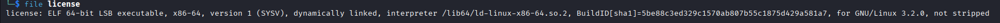
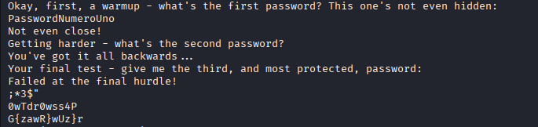
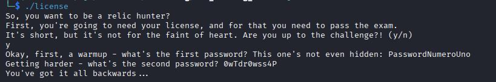
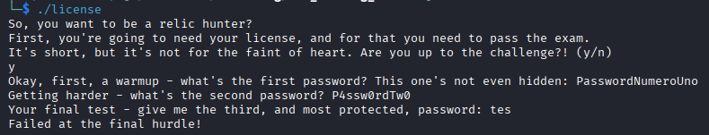
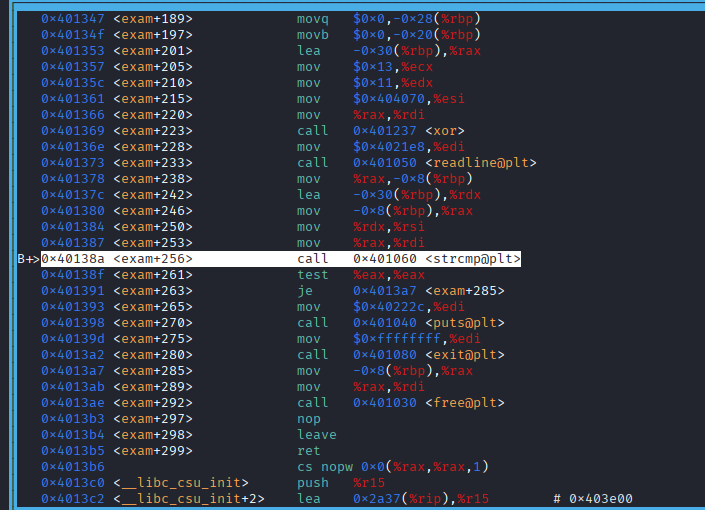
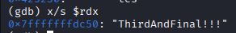
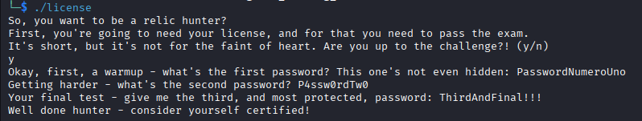
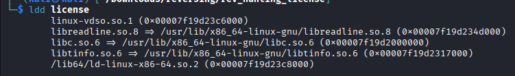
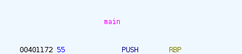

# Hunting License

**Category:** Reverse Engineering 

**Difficulty:** Very Easy

**Tags:** `License Crack`, `Ghidra`, `GDB`

---

#  Description
*STOP! Adventurer, have you got an up to date relic hunting license? If you don't, you'll need to take the exam again before you'll be allowed passage into the spacelanes!*

## 1. Introduction
We are given an ELF binary called `licensed`. The architecture is x86-64.



If we run the binary, it will ask password. Our task is to find the password. We also given an instance with some question it.

## 2. Analysis
I begin analysis by using `strings` to check is there any interesting strings inside the binary. 



Here we can see some interesting strings like `PasswordNumeroUno` and `0wTdr0wss4P`, which is possibly is the password. Let's try it.



Here we have passed the first password. But on the second password, it says `You've got it all backwards...`. So i try to reverse the strings into `P4ssw0rdTw0`.



We have passed the second password. But the third, we have no idea about it. So i try to do static analysis using ghidra. Inside the main function, we have the interesting function `exam`.

```

void exam(void)

{
  int iVar1;
  char local_38 [28];
  char local_1c [12];
  char *local_10;
  
  local_10 = (char *)readline(
                             "Okay, first, a warmup - what\'s the first password? This one\'s not ev en hidden: "
                             );
  iVar1 = strcmp(local_10,"PasswordNumeroUno");
  if (iVar1 != 0) {
    puts("Not even close!");
                    /* WARNING: Subroutine does not return */
    exit(-1);
  }
  free(local_10);
  local_1c[0] = '\0';
  local_1c[1] = '\0';
  local_1c[2] = '\0';
  local_1c[3] = '\0';
  local_1c[4] = '\0';
  local_1c[5] = '\0';
  local_1c[6] = '\0';
  local_1c[7] = '\0';
  local_1c[8] = '\0';
  local_1c[9] = '\0';
  local_1c[10] = '\0';
  local_1c[0xb] = '\0';
  reverse(local_1c,t,11);
  local_10 = (char *)readline("Getting harder - what\'s the second password? ");
  iVar1 = strcmp(local_10,local_1c);
  if (iVar1 != 0) {
    puts("You\'ve got it all backwards...");
                    /* WARNING: Subroutine does not return */
    exit(-1);
  }
  free(local_10);
  local_38[0] = '\0';
  local_38[1] = '\0';
  local_38[2] = '\0';
  local_38[3] = '\0';
  local_38[4] = '\0';
  local_38[5] = '\0';
  local_38[6] = '\0';
  local_38[7] = '\0';
  local_38[8] = '\0';
  local_38[9] = '\0';
  local_38[10] = '\0';
  local_38[0xb] = '\0';
  local_38[0xc] = '\0';
  local_38[0xd] = '\0';
  local_38[0xe] = '\0';
  local_38[0xf] = '\0';
  local_38[0x10] = 0;
  xor(local_38,t2,17,19);
  local_10 = (char *)readline("Your final test - give me the third, and most protected, password: ")
  ;
  iVar1 = strcmp(local_10,local_38);
  if (iVar1 != 0) {
    puts("Failed at the final hurdle!");
                    /* WARNING: Subroutine does not return */
    exit(-1);
  }
  free(local_10);
  return;
}
```

Here our hypothesis before is prove that the second password is take data from variable `t` and reversed using the `reverse` function. At the third password, we can see the operation `xor`. 

```
void xor(long param_1,long param_2,ulong param_3,byte param_4)

{
  undefined4 local_c;
  
  for (local_c = 0; (ulong)(long)local_c < param_3; local_c = local_c + 1) {
    *(byte *)(param_1 + local_c) = *(byte *)(param_2 + local_c) ^ param_4;
  }
  return;
}
```

This function doing xor operation with param_2, which is variable `t2`, with key param_4, which is `19`. Because i'm want to learn dynamic analysis too, I used `gdb`.



I set breakpoint on `strcmp`. Then we just need to check the `rdx` register. 



There it is. We got the third password.



We already got all the password. Now we just need to connect to the instance.

1. What is the file format of the executable?
    > ELF

    To find this answer, we just need to use `file` to get information about the file.

    

2. What is the CPU architecture of the executable?
    > x86-64

    This answer also include with the previous answer.

3. What library is used to read lines for user answers? (`ldd` may help)
    > libreadline.so.8 

    By using `ldd`, we can see any library that used within this binary.

    

4. What is the address of the `main` function?
    > 0x401172
     
    We can get this information by checking on the ghidra. Here we got the `main` address.
    
    

5. How many calls to `puts` are there in `main`? (using a decompiler may help)
    > 5

    We can check it in the decompiled code in ghidra.

    ```
    undefined8 main(void)

    {
    char cVar1;
    int iVar2;
    
    puts("So, you want to be a relic hunter?");
    puts("First, you\'re going to need your license, and for that you need to pass the exam.");
    puts("It\'s short, but it\'s not for the faint of heart. Are you up to the challenge?! (y/n)");
    iVar2 = getchar();
    cVar1 = (char)iVar2;
    if (((cVar1 != 'y') && (cVar1 != 'Y')) && (cVar1 != '\n')) {
        puts("Not many are...");
                        /* WARNING: Subroutine does not return */
        exit(-1);
    }
    exam();
    puts("Well done hunter - consider yourself certified!");
    return 0;
    }
    ```

6. What is the first password?
    > PasswordNumeroUno

    We already got this password before by using `strings`.

7. What is the reversed form of the second password?
    > 0wTdr0wss4P

    We already got this also by using `strings`.

8. What is the real second password?
    > P4ssw0rdTw0
    
    We just need to reverse the string we got before.

9. What is the XOR key used to encode the third password?
    > 19

    We got this on the `exam` function.

10. What is the third password?
    > ThirdAndFinal!!!

    We already got this before.

After answer all of the question, we will got the flag.

# `HTB{l1c3ns3_4cquir3d-hunt1ng_t1m3!}`